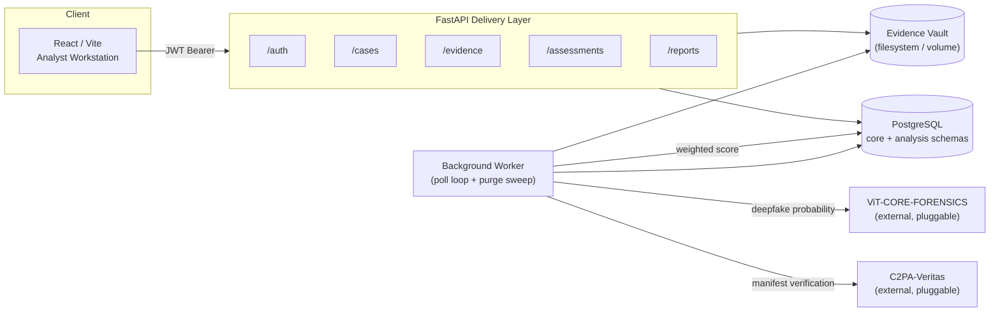

# Veritas Nexus

**Unified digital media forensics platform** — evidence intake, AI-authenticity and cryptographic-provenance correlation, and case management for investigative teams.

[](https://github.com/niiomar/Veritas-Nexus/actions/workflows/ci.yml)


---

## Table of Contents

- [Overview](#overview)
- [Key Features](#key-features)
- [Architecture](#architecture)
- [Trust Scoring Model](#trust-scoring-model)
- [Tech Stack](#tech-stack)
- [Repository Structure](#repository-structure)
- [Getting Started](#getting-started)
- [Configuration Reference](#configuration-reference)
- [Running Tests](#running-tests)
- [API Reference](#api-reference)
- [Security Model](#security-model)
- [CI/CD](#cicd)
- [Known Limitations & Roadmap](#known-limitations--roadmap)
- [Contributing](#contributing)
- [License](#license)

---

## Overview

Veritas Nexus lets an investigative team ingest digital media (images/video), run it through two independent forensic signals — an AI-authenticity classifier and cryptographic provenance verification (C2PA) — and get back a single, weighted trust assessment with full evidence and audit trail. Cases and evidence are shared across a team of analysts, with server-authoritative attribution (who created/uploaded what) and soft-delete recovery instead of destructive deletes.

The forensic engines themselves (**ViT-CORE-FORENSICS** for deepfake detection, **C2PA-Veritas** for manifest verification) are external, pluggable microservices — this repository is the orchestration layer, case management system, and analyst workstation around them. The platform is fully usable without either engine running; it just scores evidence with whatever signals are available and reports the rest as offline.

## Key Features

**Forensic pipeline**
- Async ingestion with SHA-256 hashing, EXIF/metadata extraction, and OpenCV-based Error Level Analysis, all off the request thread
- Pluggable AI-authenticity and C2PA provenance engines, invoked by a background worker so uploads never block on a slow model
- A deterministic, weighted trust-scoring model across six forensic domains (see [below](#trust-scoring-model))
- Graceful degradation: missing engines, corrupt files, or unsupported formats produce an explicit disposition instead of a crash

**Case & evidence management**
- Shared team visibility (any analyst can view any case) with creator-only edit/delete/restore rights
- Soft-delete with a recoverable grace period, a background purge sweep, an "Undo" toast right after deleting, and a "Recently Deleted" view to recover anything within the full grace period
- Offset/limit pagination and per-case filtering on the evidence ledger
- A full audit trail (`core.audit_events`) for every state-changing action
- One-click PDF report generation: an immutable, timestamped snapshot of a piece of evidence's case details, provenance, and full trust-score breakdown

**Platform**
- Real per-user auth: bcrypt password hashing, JWT access tokens, email verification and password reset flows
- Rate limiting on authentication endpoints
- Server-authoritative attribution everywhere — the client can't spoof who created a case or uploaded evidence
- A real integration test suite (pytest + testcontainers, a live ephemeral Postgres) and a GitHub Actions CI pipeline

## Architecture



- **API layer** (`api/`) — FastAPI routers for auth, cases, evidence, assessments, and reports. Stateless request handling; all mutation goes through SQLAlchemy's async engine.
- **Persistence** (`infrastructure/persistence/`) — SQLAlchemy ORM models and the async engine/session factory. Two Postgres schemas: `core` (users, cases, evidence, reports, audit events) and `analysis` (analysis jobs).
- **Background worker** (`api/worker.py`) — a single asyncio poll loop, run as a lifespan task alongside the API process. Picks up `PENDING` analysis jobs, calls out to the forensic engines, writes the weighted assessment, and runs a periodic soft-delete purge sweep.
- **Migrations** (`alembic/`) — every schema change is a tracked migration; nothing is applied to a database by hand.
- **Frontend** (`frontend/`) — a Vite + React + TypeScript single-page analyst workstation: case list, ingestion pipeline, decision workspace, and auth screens.

## Trust Scoring Model

Every piece of evidence is scored across six independent, additive domains (`api/services/assessment_engine.py`), summing to a 0–100 confidence score:

| Domain | Max Points | Signal |
|---|---|---|
| Cryptographic Provenance | 30 | C2PA manifest signature validity |
| AI Authenticity | 25 | Deepfake-probability band from the ViT engine |
| Metadata Integrity | 15 | EXIF presence, GPS, MakerNotes (only counted if extraction actually succeeded) |
| Structural Consistency | 15 | Error Level Analysis, double-compression, color-profile anomalies |
| Chain of Custody | 10 | Destructive export / social-media-origin signals |
| Contextual Correlation | 5 | Hardware sensor fingerprint, perceptual hash |

The final score maps to a verdict:

| Score / condition | Verdict |
|---|---|
| Signed+valid **and** high deepfake probability | `CONFLICT` — contradictory evidence |
| High deepfake probability, or an invalid signature | `CRITICAL` — likely manipulated |
| ≥ 75 | `VERIFIED` |
| 40–74 | `UNVERIFIED` — insufficient provenance |
| < 40 | `INCONCLUSIVE` |

Unsupported formats or media rejected by the AI engine short-circuit straight to a `REJECTED` disposition without running the rest of the pipeline.

## Tech Stack

| Layer | Technology |
|---|---|
| API | FastAPI, Pydantic v2, Uvicorn |
| Persistence | PostgreSQL 15, SQLAlchemy 2.0 (async), Alembic |
| Auth | bcrypt, PyJWT, slowapi (rate limiting) |
| Forensics | Pillow, OpenCV (headless), imagehash, exiftool |
| Reporting | ReportLab (PDF generation) |
| Frontend | React 19, TypeScript, Vite, lucide-react |
| Testing | pytest, pytest-asyncio, testcontainers, httpx, Vitest, React Testing Library |
| Infra | Docker Compose, GitHub Actions |

## Repository Structure

```
api/
├── main.py              # FastAPI app, lifespan, CORS, rate limiter, health check
├── worker.py             # Background poll loop: runs forensic engines, purges soft-deletes
├── dependencies.py        # DB session + JWT auth dependency
├── constants.py           # Soft-delete grace period, etc.
├── rate_limiting.py       # Shared slowapi Limiter instance
├── routers/               # auth, cases, evidence, assessments, reports
└── services/               # auth_service, email_service, exif_core, assessment_engine, report_service

infrastructure/persistence/
├── models.py              # SQLAlchemy ORM models (User, Case, Evidence, AnalysisJob, Report, AuditEvent)
└── database.py            # Async engine + session factory

alembic/                   # Tracked schema migrations (source of truth for the DB schema)
tests/                     # pytest integration + unit suite (real Postgres via testcontainers)
frontend/src/
├── components/            # AuthScreen, Sidebar, DecisionWorkspace, RecentlyDeletedModal, ingestion/case modals
├── services/               # api.ts, auth.ts, assessment.ts
└── App.tsx
```

## Getting Started

### Prerequisites

- Docker and Docker Compose
- Node.js 22+ (for the frontend)
- Python 3.11+ (only needed to run the backend test suite outside Docker)

### 1. Clone and configure

```bash
git clone https://github.com/niiomar/Veritas-Nexus.git
cd Veritas-Nexus
cp .env.example .env
cp frontend/.env.example frontend/.env
```

Edit `.env` and set at minimum:

```bash
JWT_SECRET=$(python -c "import secrets; print(secrets.token_urlsafe(32))")
```

Everything else in `.env.example` has a working local default — see the [Configuration Reference](#configuration-reference) for what each variable does.

### 2. Launch the backend

```bash
docker compose up -d --build
```

This starts `nexus_db` (Postgres) and `nexus_api` (FastAPI, hot-reloading on code changes via a bind mount). A named volume (`nexus_storage_vault`) persists uploaded evidence across container recreation.

### 3. Apply database migrations

```bash
docker exec nexus_api alembic upgrade head
```

The API will run without this, but every endpoint that touches the database will fail until the schema exists.

### 4. Launch the frontend

```bash
cd frontend
npm install
npm run dev
```

Visit `http://localhost:5173`. Register an account — since no SMTP is configured by default, the verification email is written to the `nexus_api` container logs instead of sent:

```bash
docker logs nexus_api | grep -A3 "would send to"
```

Copy the verification link from the log output into your browser to activate the account, then log in.

### Optional: the forensic engines

`VIT_CORE_URL` and `C2PA_URL` point at external microservices (default: `host.docker.internal:8001`/`:8002`), which are **not part of this repository**. Without them, evidence still ingests and scores normally — the AI-authenticity and provenance domains simply report no signal, and `GET /api/v1/health` shows them `OFFLINE`.

## Configuration Reference

All variables live in `.env` (root, consumed by the backend) and `frontend/.env` (consumed by Vite at build time).

| Variable | Required | Default | Purpose |
|---|---|---|---|
| `JWT_SECRET` | **Yes** | — | Signs access/verification/reset tokens. The app refuses to start without it. |
| `VIT_CORE_API_KEY` | No | — | Auth for the external ViT-CORE deepfake-detection engine. |
| `C2PA_API_KEY` | No | — | Auth for the external C2PA-Veritas provenance engine. |
| `FRONTEND_URL` | No | `http://localhost:5173` | Base URL used to build verification/reset links in emails. |
| `CORS_ORIGINS` | No | `http://localhost:5173,http://127.0.0.1:5173` | Comma-separated allowed origins. Set explicitly in production. |
| `EVIDENCE_VAULT_PATH` | No | `/app/storage_vault` | Where uploaded evidence is written inside the container. |
| `SMTP_HOST` / `SMTP_PORT` / `SMTP_USERNAME` / `SMTP_PASSWORD` / `SMTP_FROM` | No | unset (log-only) | Configure to send real verification/reset emails instead of logging them. |
| `DATABASE_URL` | No | points at the compose `db` service | Override to point the API at a different Postgres instance. |
| `VIT_CORE_URL` / `C2PA_URL` | No | `host.docker.internal:8001`/`:8002` | Endpoints for the external forensic microservices. |
| `VITE_API_URL` (frontend) | No | `http://localhost:8000` | Base URL the frontend calls for the API. |

## Running Tests

**Backend** — real integration tests against an ephemeral Postgres container (requires Docker running):

```bash
pip install -r requirements-dev.txt
pytest tests/ -v
```

**Frontend**:

```bash
cd frontend
npm run test        # Vitest
npx tsc -b --noEmit  # typecheck
npm run build        # production build
```

## API Reference

The full interactive OpenAPI documentation is served at `http://localhost:8000/docs` once the API is running. Route groups:

| Prefix | Purpose |
|---|---|
| `/api/v1/auth` | Register, verify email, login, forgot/reset password, `me` |
| `/api/v1/cases` | Create, list, get, update, soft-delete, restore |
| `/api/v1/evidence` | Ingest, list (paginated), download, heatmap/patches/attention, soft-delete, restore |
| `/api/v1/assessments` | Fetch the computed trust assessment for a piece of evidence |
| `/api/v1/reports` | Generate and download a PDF authenticity-report snapshot for a piece of evidence |
| `/api/v1/health` | Liveness + downstream-engine reachability |

## Security Model

- **Authentication**: JWT access tokens (12h TTL), bcrypt-hashed passwords, and purpose-scoped tokens for email verification and password reset so one can't be replayed as the other.
- **Authorization**: shared team visibility — any authenticated analyst can view any case or evidence — but only the creator/uploader may edit, delete, or restore it. Enforced server-side on every mutating route.
- **Enumeration resistance**: login and forgot-password return identical generic responses regardless of whether the account exists.
- **Rate limiting**: register, login, and forgot-password are rate-limited per client.
- **Soft delete**: deletes are reversible for a grace period (`api/constants.py`) before a background sweep physically purges the row and file.
- **Server-authoritative attribution**: `created_by`/`uploaded_by`/audit `performed_by` are always derived from the authenticated session, never from client input.
- **Secrets**: `.env` is gitignored; the app fails fast at startup if `JWT_SECRET` is missing rather than surfacing the failure on first login.

## CI/CD

GitHub Actions (`.github/workflows/ci.yml`) runs on every push and pull request to `main`:

- **backend** — byte-compiles the codebase, then runs the full pytest suite against a real ephemeral Postgres (via testcontainers)
- **frontend** — typechecks, lints (non-blocking — see [Roadmap](#known-limitations--roadmap)), runs Vitest, and produces a production build

## Known Limitations & Roadmap

- Report generation isn't wired into the frontend yet — trigger it via the API (`/docs`) or a REST client until a UI button is added.
- The frontend lint step is intentionally non-blocking in CI while a backlog of pre-existing `no-explicit-any` and strict React Compiler rule violations is worked down.
- `opencv-python-headless` is deliberately held on the 4.x line pending verification of the 5.x major.
- Authorization is a flat "any analyst can view, creator can edit" model; role-based access (e.g. admin override, per-case assignment) is a natural next step if the team grows.

## Contributing

1. Branch from `main`.
2. Run the full backend (`pytest tests/ -v`) and frontend (`npm run test && npx tsc -b --noEmit && npm run build`) suites before opening a PR.
3. Keep migrations additive and reversible — every schema change belongs in `alembic/versions/`, never applied by hand.
4. CI must be green (the lint step's pre-existing backlog aside) before merge.

## License

Proprietary — All rights reserved. See [LICENSE](LICENSE).
